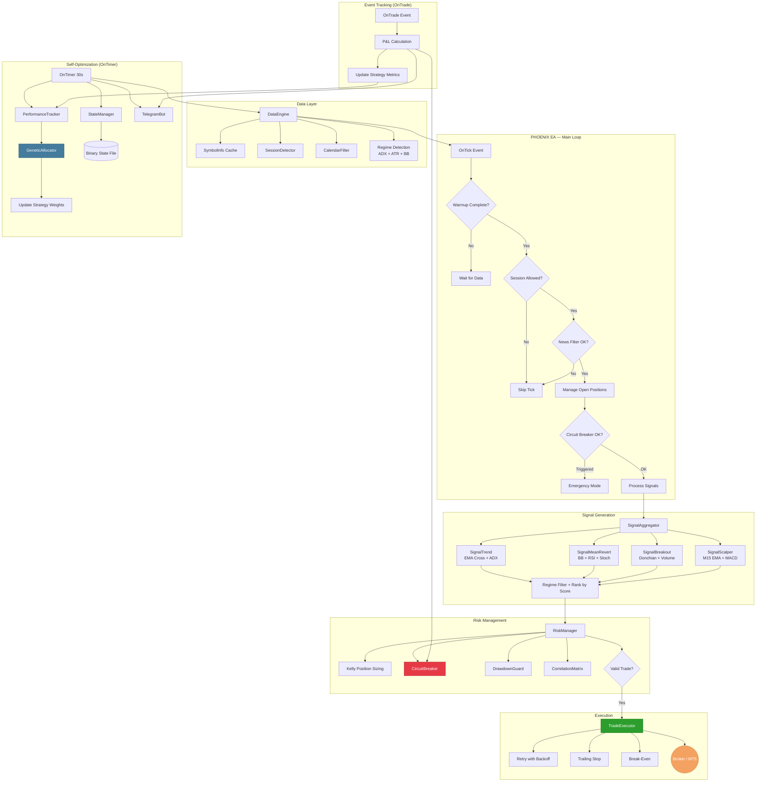

# PHOENIX EA — System Architecture

## Mermaid Diagram



## Component Dependencies

```
Phoenix_EA.mq5
├── Core/Defines.mqh          (constants, enums, structs)
├── Core/Logger.mqh           (leveled logging with rotation)
├── Core/Globals.mqh          (state hub, account detection)
├── Data/DataEngine.mqh       (multi-symbol data aggregation)
│   ├── Data/SymbolInfo.mqh   (cached symbol properties)
│   ├── Data/SessionDetector.mqh (trading session awareness)
│   └── Data/CalendarFilter.mqh  (economic news filter)
├── Signal/SignalAggregator.mqh  (strategy orchestrator)
│   ├── Signal/SignalBase.mqh    (abstract base class)
│   ├── Signal/SignalTrend.mqh   (trend following)
│   ├── Signal/SignalMeanRevert.mqh (mean reversion)
│   ├── Signal/SignalBreakout.mqh   (breakout/momentum)
│   └── Signal/SignalScalper.mqh    (session scalper)
├── Risk/RiskManager.mqh      (position sizing + validation)
│   ├── Risk/CircuitBreaker.mqh  (emergency stop)
│   └── Risk/DrawdownGuard.mqh   (progressive risk scaling)
├── Risk/CorrelationMatrix.mqh   (cross-pair filter)
├── Execution/TradeExecutor.mqh  (smart execution + trailing)
├── Optimization/PerformanceTracker.mqh (Sharpe, win rate, expectancy)
├── Optimization/GeneticAllocator.mqh   (capital allocation GA)
├── Persistence/StateManager.mqh (binary state save/restore)
└── Monitor/TelegramBot.mqh     (WebRequest notifications)
```

## Data Flow

1. **Tick arrives** → DataEngine refreshes symbol cache
2. **Session check** → SessionDetector validates trading hours
3. **News check** → CalendarFilter blocks if high-impact news imminent
4. **Position management** → TradeExecutor applies trailing/break-even
5. **Risk check** → CircuitBreaker + DrawdownGuard validate system health
6. **Signal generation** → All 4 strategies evaluate independently
7. **Signal filtering** → Regime suitability + correlation check
8. **Signal ranking** → Confidence × R:R × allocation weight
9. **Position sizing** → Kelly fraction + ATR volatility targeting
10. **Execution** → TradeExecutor with retries + slippage control
11. **Feedback** → OnTrade updates metrics → feeds into genetic optimizer

## Risk Layers (Defense in Depth)

| Layer | Component | Protection |
|-------|-----------|------------|
| 1 | Individual SL/TP | Per-trade risk capped |
| 2 | Position Sizing | Kelly + ATR = risk-calibrated lots |
| 3 | Max Positions | Capital concentration limit |
| 4 | Correlation Filter | Cross-pair exposure limit |
| 5 | Drawdown Guard | Progressive risk reduction |
| 6 | Circuit Breaker | Full stop on daily/total DD |
| 7 | News Filter | Pause before volatility events |
| 8 | Session Filter | Only trade in liquid hours |
| 9 | Regime Filter | Match strategy to market condition |
